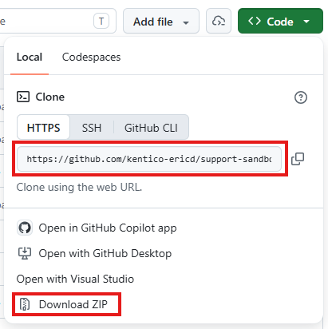

# Xperience by Kentico SaaS Sandbox Project

[](https://github.com/kentico-ericd/support-sandbox/actions/workflows/ci.yml)

## Description

This project is the sample Dancing Goat website which can be deployed to the Support team's [sandbox SaaS environments](https://xperience-portal.com/67cd472c-ab16-453f-f8e3-08dbdac1379b) for testing purposes. The project will be updated to include common scenarios such as rich text editor customizations- please create a GitHub issue if you would like something to be added to the project!

> [!NOTE]  
> Current Xperience by Kentico version is 31.7.2

## Running the sandbox locally

If you need to test something in the SaaS environment, first download this project locally, make your changes, and deploy it to the sandbox environment.

1. **Clone** the repository or download the ZIP file

   

1. Use [xman](https://github.com/Kentico/xperience-by-kentico-manager) to create a blank database matching the version of this repository (see [Description](#description))

   ```ps
   xman i db
   ```

1. Edit the CMSConnectionString in the `appsettings.json` file in /src to connect the the new database

1. Execute the `CD-Restore.ps1` script, e.g. in Powershell or by right-clicking the file > **Run with PowerShell**

   ```ps
   C:\Users\youruser\downloads\support-sandbox\scripts> .\CD-Restore.ps1
   ```

1. Run the application and log in with the credentials stored in Secret Server
